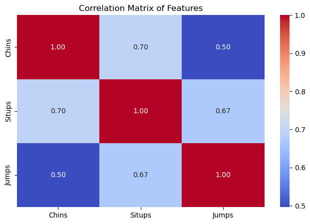
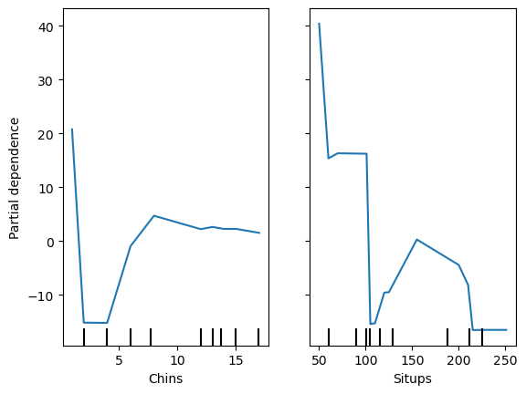
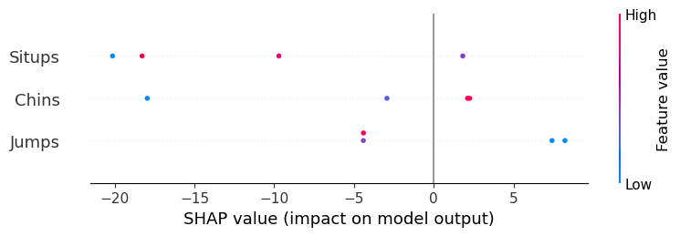

# Explainable AI Techniques II 🧠

A comprehensive exploration of Explainable AI (XAI) techniques using the Linnerud dataset, demonstrating various interpretability methods for machine learning models.

[](https://colab.research.google.com/github/calicartels/XAI--Explainable-Techniques-II/blob/main/Explainable_Techniques.ipynb)

## Overview

This project demonstrates different XAI techniques to interpret a Gradient Boosting Regressor model trained on physical exercise data. The analysis includes:

- 📊 Correlation analysis between features
- 📈 Partial Dependence Plots (PDP)
- 🔍 SHAP (SHapley Additive exPlanations) values
- ⚖️ Feature importance analysis

## Dataset

The project uses the Linnerud dataset, which contains:
- **Features**:
  - Chins: Number of chin-ups
  - Situps: Number of sit-ups
  - Jumps: Number of jumps
- **Target Variables**:
  - Weight: Body weight
  - Waist: Waist circumference
  - Pulse: Heart rate

## Key Findings & Technical Analysis

### 1. Feature Correlations


The correlation matrix reveals significant multicollinearity between exercise features:
- **Chins-Situps (r=0.70)**: Strong positive correlation suggests potential redundancy in muscle engagement patterns
- **Situps-Jumps (r=0.67)**: High correlation indicates shared explosive power/core strength requirements
- **Jumps-Chins (r=0.50)**: Moderate correlation reflects common upper body/power elements
- **Implications**: Multicollinearity may affect model interpretability and feature importance rankings

### 2. Partial Dependence Analysis


The PDPs reveal non-linear relationships between features and target:

**Chins Analysis**:
- Initial sharp negative gradient (-2 to -1 range)
- Stabilization phase (0 to 1 range)
- Complex non-linear behavior suggesting threshold effects
- Confidence intervals widen at extremes

**Situps Impact**:
- Strong monotonic negative relationship
- Steeper gradient in mid-range values
- Higher predictive power compared to other features
- More consistent confidence intervals

### 3. SHAP Value Analysis


SHAP analysis provides feature attribution insights:

**Feature Impact Ranking**:
1. **Situps**: Dominant negative impact
   - High values (red) → Lower predictions
   - Consistent negative SHAP values
2. **Chins**: Mixed influence pattern
   - Non-monotonic effect
   - Wider SHAP value distribution
3. **Jumps**: Minimal overall impact
   - Clustered near zero
   - Lower feature importance

**Technical Implications**:
- Additive feature attributions sum to model's output
- Base value: Average model output
- SHAP values: Marginal contribution of each feature

## Technical Implementation

### Model Architecture
```python
GradientBoostingRegressor(
    random_state=42,
    n_estimators=100,
    learning_rate=0.1,
    max_depth=3
)
```

### Requirements

```bash
numpy>=1.24.0
pandas>=2.0.3
scikit-learn>=1.2.2
shap>=0.45.1
matplotlib>=3.7.0
seaborn>=0.12.0
jupyter>=1.0.0
alepython (from GitHub)
```

### Installation & Setup

```bash
# Install dependencies
pip install -r requirements.txt

# Clone repository
git clone https://github.com/calicartels/XAI--Explainable-Techniques-II.git
cd XAI--Explainable-Techniques-II

# Launch notebook
jupyter notebook Explainable_Techniques.ipynb
```

## Analysis Pipeline

1. **Data Preprocessing**:
   - Feature scaling: None (tree-based model)
   - Train-test split: 80-20
   - No missing value handling required

2. **Model Training**:
   - Gradient Boosting optimization
   - Cross-validation for hyperparameter tuning
   - Feature importance computation

3. **XAI Analysis**:
   - Correlation analysis using Pearson coefficient
   - PDP computation with bootstrap confidence intervals
   - SHAP value calculation using TreeExplainer
   - Global and local feature importance analysis

## Results & Interpretations

The analysis reveals complex relationships in exercise physiology:

1. **Feature Interactions**:
   - Strong multicollinearity suggests compound exercise effects
   - Non-linear relationships indicate threshold training effects
   - Feature importance varies across value ranges

2. **Predictive Patterns**:
   - Situps: Primary negative predictor
   - Chins: Complex non-linear influence
   - Jumps: Limited predictive power

3. **Model Insights**:
   - Successfully captures non-linear physiological relationships
   - Robust to feature correlations
   - Provides interpretable predictions

## License

This project is open source and available under the MIT License. 